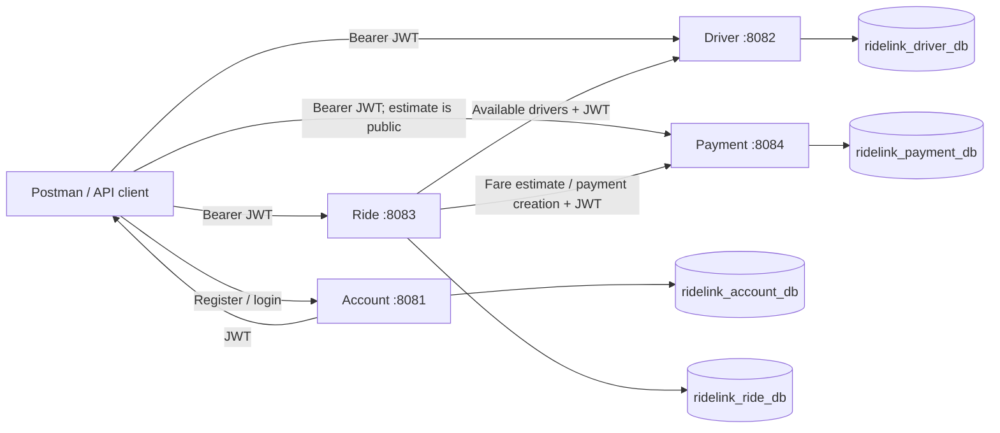
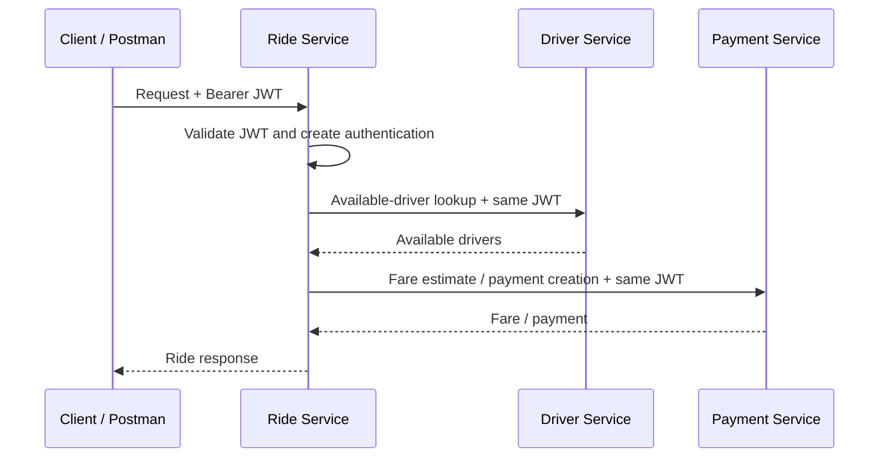

# RideLink Microservices

RideLink is a backend-only ride-sharing platform for the IT3130 Application Development group assignment. Four independently runnable Java 17 / Spring Boot 4.1.1 services provide account authentication, driver and vehicle management, ride management, and simulated fare/payment processing. Persistence uses MongoDB, with MongoDB Atlas supported for deployment. APIs are exercised through Postman and Swagger/OpenAPI for all four services. GitHub Actions defines build/test jobs for all four services.

This README describes the checked-in implementation. Setup examples contain placeholders, never deployment credentials. Known implementation limitations are identified explicitly so that demonstrations and assessment match the code.

## 1. Project overview

The supported roles are `PASSENGER`, `DRIVER`, and `ADMIN`. A typical demonstration registers accounts, logs in to obtain an Account-issued JWT, creates a driver profile, marks the driver available, requests a fare estimate, creates and progresses a ride, creates a simulated payment, updates its status, and retrieves a JSON receipt.

The project demonstrates REST service boundaries, separate MongoDB persistence, JWT authentication and selected role restrictions, synchronous inter-service calls, validation, exception handling, automated tests, and CI. There is no frontend, real payment gateway, live GPS provider, or route-distance calculation. Clients supply distance and location values.

## 2. System architecture

| Service | Folder | Default port | Responsibility | Configured database |
| --- | --- | ---: | --- | --- |
| Account Service | `account-service/` | 8081 | Registration, login, JWT issuance, profiles, account status | `ridelink_account_db` |
| Driver & Vehicle Service | `driver-vehicle-service/` | 8082 | Operational driver profile, embedded vehicle fields, availability and location | `ridelink_driver_db` |
| Ride Management Service | `ride-service/` | 8083 | Ride creation, assignment, lifecycle and histories | `ridelink_ride_db` |
| Fare & Payment Service | `fare-payment-service/` | 8084 | Fare calculations, simulated payments, histories and receipts | `ridelink_payment_db` |

Each service has its own Maven project and application entry point. There is no root Maven aggregator. Repository interfaces access only their service's documents; inter-service integration uses HTTP rather than another service's database.



The databases may share an Atlas cluster while remaining distinct persistence boundaries. Tokens are verified locally; Driver, Ride, and Payment do not call Account on every request.

## 3. Repository structure

```text
ridelink-microservices/
|-- .github/workflows/ci.yml
|-- account-service/
|-- driver-vehicle-service/
|-- ride-service/
|   |-- README.md
|   '-- JWT_INTEGRATION.md
|-- fare-payment-service/
|   '-- JWT-SETUP.md
|-- docs/
|   |-- architecture/.gitkeep
|   |-- sequence-diagrams/.gitkeep
|   '-- screenshots/.gitkeep
|-- postman/
|   |-- RideLink_API.postman_collection.json
|   '-- RideLink_Local.postman_environment.json
|-- .gitignore
'-- README.md

Each service contains:
|-- .mvn/wrapper/maven-wrapper.properties
|-- mvnw
|-- mvnw.cmd
|-- pom.xml
'-- src/
    |-- main/java/com/ridelink/<service-package>/
    |-- main/resources/application.properties
    '-- test/java/com/ridelink/<service-package>/
```

The Java package suffixes are `account`, `driver`, `ride`, and `payment`. The `docs/` subdirectories still contain `.gitkeep` placeholders; no screenshot evidence is included there. The `postman/` directory contains the supplied Postman Collection v2.1 and local environment exports. Service-specific documentation exists, but some historical configuration statements conflict with the final source; this README follows the source.

## 4. Technology stack

| Technology | Repository evidence / version |
| --- | --- |
| Java | `java.version=17` in all four POMs; CI also uses 17 |
| Spring Boot | Parent version `4.1.1` in all four POMs |
| Maven | Wrapper `3.3.4`, configured Maven distribution `3.9.16` |
| HTTP APIs | Spring Web MVC, JSON, synchronous Spring `RestClient` in Ride |
| Persistence | Spring Data MongoDB; Atlas connection support; CI uses `mongo:7` |
| Security | Spring Security; OAuth2 Resource Server with Nimbus JWT decoder in Driver/Ride/Payment |
| JWT signing | JJWT `0.12.6` in Account; same version used only for token signing in other services' tests |
| Passwords | BCrypt in Account |
| Validation / boilerplate | Jakarta Bean Validation; Lombok in Driver/Ride/Payment |
| OpenAPI | springdoc `2.8.6` in Account/Ride; `3.0.0` in Driver; `3.1.1` in Payment |
| Tests | JUnit Jupiter, parameterized tests, Mockito, Spring Test/MockMvc, AssertJ; versions managed by the Boot parent |
| Development / demonstration | Git, GitHub, Postman; VS Code or IntelliJ IDEA |
| CI | GitHub Actions; `actions/checkout@v4`, `actions/setup-java@v4`, Temurin 17 |

Do not infer installed local tool versions from these build declarations. Check your own JDK and wrapper before running.

## 5. Microservice details

### Account Service

- Port `8081`; database `ridelink_account_db`; package `com.ridelink.account`.
- Packages: `config`, `controller`, `dto`, `exception`, `model`, `repository`, `security`, `service`.
- Registers users, normalizes email with trimming/lowercasing, hashes passwords with BCrypt, and issues JWTs after registration or successful login.
- New accounts have status `ACTIVE`. Login rejects `SUSPENDED` and `DEACTIVATED` accounts.
- Supports own-profile retrieval/update, self-or-admin account lookup, admin-only status update, and an internal account-status endpoint checked with `X-Internal-Key`.
- Public registration currently accepts all three roles, including `ADMIN`; there is no separate admin provisioning approval.
- Status changes do not revoke already issued tokens. Other services do not consult account status when validating a JWT.

### Driver & Vehicle Service

- Port `8082`; database `ridelink_driver_db`; package `com.ridelink.driver`.
- Packages: `config`, `controller`, `dto`, `exception`, `model`, `repository`, `service`.
- Stores a driver profile linked by `accountId`, with licence, vehicle, service area, availability and simulated location fields.
- New profiles start `UNAVAILABLE`; the available states are `AVAILABLE`, `UNAVAILABLE`, and `ON_TRIP`.
- Rejects a second profile for the same account through an application-level lookup.
- Available-driver lookup accepts any valid supported role and optionally filters by exact `serviceArea`. Other implemented Driver endpoints require DRIVER or ADMIN.
- Vehicle data is embedded in the driver document; there is no separate vehicle collection or controller.
- The service does not call Account to validate the submitted `accountId`, bind that ID to the JWT subject, or enforce per-driver ownership.

### Ride Management Service

- Port `8083`; database `ridelink_ride_db`; package `com.ridelink.ride`.
- Packages: `client`, `config`, `controller`, `dto`, `exception`, `model`, `repository`, `service`, `service.impl`.
- Supports creation, lookup by either identifier, passenger/driver histories, explicit or automatic assignment, acceptance, starting, completion and cancellation.
- Generates a business identifier as `RIDE` plus eight uppercase UUID characters and checks for an existing identifier before saving.
- Automatic assignment chooses the first returned available driver; explicit assignment checks membership in the same available list. There is no nearest-driver matching or reservation.
- Every implemented Ride API requires JWT authentication, but all three roles may use every operation. Subject-to-passenger/driver ownership is not enforced.

| Action | Required current state | Result |
| --- | --- | --- |
| Create | New ride | REQUESTED |
| Assign | REQUESTED | ASSIGNED |
| Accept | ASSIGNED | ACCEPTED |
| Start | ACCEPTED | IN_PROGRESS |
| Complete | IN_PROGRESS | COMPLETED |
| Cancel | REQUESTED, ASSIGNED or ACCEPTED | CANCELLED |

Invalid transitions return `409`. Cancellation from IN_PROGRESS is rejected, despite the broader arrow in the `RideStatus` source comment. Lifecycle timestamps and cancellation reason are stored. Completion recalculates fare and attempts payment creation; payment failure does not prevent completion from being saved.

### Fare & Payment Service

- Port `8084`; database `ridelink_payment_db`; package `com.ridelink.payment`.
- Uses `spring.mongodb.uri=${MONGODB_URI}` and `spring.mongodb.database=ridelink_payment_db`; configure MONGODB_URI in the launch environment.
- Includes springdoc `3.1.1`, OpenAPI metadata, public Swagger UI at `http://localhost:8084/swagger-ui.html`, and OpenAPI JSON at `http://localhost:8084/v3/api-docs`.
- Packages: `config`, `controller`, `dto`, `exception`, `model`, `repository`, `service`, `service.impl`.
- Provides public fare estimation, authenticated fare calculation, payment creation, all-payment listing, ID/ride lookup, passenger history, status update and JSON receipt retrieval.
- Both fare implementations use `150 + (distanceKm * 80)`; 10 km produces 950. The API does not include a currency field.
- Estimation uses `Double` and returns `estimatedFare`; the separate calculation endpoint uses `BigDecimal` and returns `totalFare`.
- New payments are `PENDING`, with `transactionReference = "TXN-" + UUID`.
- Status updates accept `PENDING`, `SUCCESS`, or `FAILED` without checking the previous state. A typical demo changes PENDING to SUCCESS or FAILED, but reverse/repeated transitions are also permitted.
- Receipts are read-only JSON projections available in every payment state, not just SUCCESS. Legacy records can have a null transaction reference.
- There is no payment gateway, payment-method enum, duplicate-payment prevention, or validation of the requested amount against a Ride record. All supported JWT roles have equal access to Payment APIs.

## 6. Complete API reference

These tables enumerate **32 controller method/route pairs**: Account 7, Driver 6, Ride 10, Payment 9. Framework documentation/error paths are listed separately. “Any role” means PASSENGER, DRIVER or ADMIN for the resource-server services. Send JSON with `Content-Type: application/json`.

All examples below are illustrative shapes, not captured production data. Substitute IDs, timestamps, credentials and tokens locally.

### Account: http://localhost:8081

| Method | Endpoint | Authentication | Role(s) / rule | Purpose / success |
| --- | --- | --- | --- | --- |
| POST | `/api/v1/auth/register` | Public | Requested role validated | Register; 201, AuthResponse |
| POST | `/api/v1/auth/login` | Public | Account must be ACTIVE | Login; 200, AuthResponse |
| GET | `/api/v1/accounts/me` | Bearer JWT | Authenticated caller | Own profile; 200 |
| PUT | `/api/v1/accounts/me` | Bearer JWT | Authenticated caller | Update own profile; 200 |
| GET | `/api/v1/accounts/{userId}` | Bearer JWT | Same user or ADMIN | Account profile; 200 |
| PATCH | `/api/v1/accounts/{userId}/status` | Bearer JWT | ADMIN | Set account status; 200 |
| GET | `/api/v1/internal/accounts/{userId}` | `X-Internal-Key` | Matching configured internal key; JWT not required | Internal account status; 200 |

Registration body:

```json
{
  "email": "YOUR_REGISTERED_EMAIL",
  "password": "YOUR_ACCOUNT_PASSWORD",
  "fullName": "YOUR_FULL_NAME",
  "phone": "YOUR_PHONE_NUMBER",
  "role": "PASSENGER"
}
```

Required: nonblank valid `email`, nonblank `password` of 8-72 characters, nonblank `fullName`, and `role` exactly PASSENGER, DRIVER or ADMIN. `phone` is optional. Replace the email placeholder with a syntactically valid address. Invalid fields produce 400; an already registered normalized email produces 409.

Login body:

```json
{"email":"YOUR_REGISTERED_EMAIL","password":"YOUR_ACCOUNT_PASSWORD"}
```

Both fields are nonblank and email must be valid. Wrong credentials return 401; correct credentials for an inactive account return 403. Registration/login response shape:

```json
{"token":"YOUR_RETURNED_JWT","userId":"YOUR_ACCOUNT_ID","email":"YOUR_REGISTERED_EMAIL","role":"PASSENGER","status":"ACTIVE"}
```

Own-profile update body:

```json
{"fullName":"YOUR_UPDATED_NAME","phone":"YOUR_UPDATED_PHONE"}
```

Both fields are optional; null/blank fullName is ignored, a non-null phone is applied, and updatedAt changes. It returns an AccountResponse with `userId, email, fullName, phone, role, status, createdAt, updatedAt`. Password hashes are never returned by these DTOs. Example profile response:

```json
{"userId":"YOUR_ACCOUNT_ID","email":"YOUR_REGISTERED_EMAIL","fullName":"YOUR_UPDATED_NAME","phone":"YOUR_UPDATED_PHONE","role":"PASSENGER","status":"ACTIVE","createdAt":"2026-10-03T09:00:00Z","updatedAt":"2026-10-03T09:05:00Z"}
```

Admin status body is `{"status":"SUSPENDED"}`; status must be nonblank and exactly ACTIVE, SUSPENDED or DEACTIVATED. Returns the updated AccountResponse; invalid status is 400, non-admin is 403, missing account is 404. Internal lookup returns `{"userId":"YOUR_ACCOUNT_ID","role":"PASSENGER","status":"ACTIVE","active":true}`; missing/wrong internal key is 401 and missing account is 404.

### Driver: http://localhost:8082

| Method | Endpoint | Authentication | Role(s) | Purpose / success |
| --- | --- | --- | --- | --- |
| POST | `/api/drivers` | Bearer JWT | DRIVER, ADMIN | Register profile; 201 |
| GET | `/api/drivers/{id}` | Bearer JWT | DRIVER, ADMIN | Driver by document ID; 200 |
| GET | `/api/drivers/account/{accountId}` | Bearer JWT | DRIVER, ADMIN | Driver by Account ID; 200 |
| PATCH | `/api/drivers/{id}/availability` | Bearer JWT | DRIVER, ADMIN | Set query parameter `status`; 200 |
| PATCH | `/api/drivers/{id}/location` | Bearer JWT | DRIVER, ADMIN | Update location; 200 |
| GET | `/api/drivers/available` | Bearer JWT | Any role | List AVAILABLE drivers; optional `serviceArea`; 200 |

Profile body:

```json
{
  "accountId": "{{driverAccountId}}",
  "licenseNumber": "YOUR_LICENSE_NUMBER",
  "vehicleMake": "Toyota",
  "vehicleModel": "Prius",
  "vehiclePlateNumber": "YOUR_VEHICLE_PLATE",
  "serviceArea": "Colombo"
}
```

All fields except serviceArea are required and nonblank. Missing/blank required fields return 400; duplicate account profile returns 409. Example response, also the shape returned by lookup and updates:

```json
{
  "id": "YOUR_DRIVER_DOCUMENT_ID",
  "accountId": "YOUR_DRIVER_ACCOUNT_ID",
  "licenseNumber": "YOUR_LICENSE_NUMBER",
  "vehicleMake": "Toyota",
  "vehicleModel": "Prius",
  "vehiclePlateNumber": "YOUR_VEHICLE_PLATE",
  "status": "UNAVAILABLE",
  "serviceArea": "Colombo",
  "currentLatitude": null,
  "currentLongitude": null,
  "createdAt": "2026-10-03T09:00:00Z",
  "updatedAt": "2026-10-03T09:00:00Z"
}
```

Availability uses **a query parameter, not a JSON body**:
`PATCH /api/drivers/{{driverId}}/availability?status=AVAILABLE`.
Supported values are AVAILABLE, UNAVAILABLE, ON_TRIP; no transition guard is present. Location body is `{"latitude":6.9271,"longitude":79.8612}`. Both coordinates are non-null numbers; geographic range validation is not implemented. Missing driver returns 404. Available lookup returns an array, including `[]` when none match; `?serviceArea=Colombo` filters by the stored area.

### Ride: http://localhost:8083

| Method | Endpoint | Authentication | Role(s) | Purpose / success |
| --- | --- | --- | --- | --- |
| POST | `/api/rides` | Bearer JWT | Any role | Create; 201 |
| GET | `/api/rides/{rideId}` | Bearer JWT | Any role | Lookup by business rideId; 200 |
| GET | `/api/rides/id/{id}` | Bearer JWT | Any role | Lookup by MongoDB ID; 200 |
| GET | `/api/rides/passenger/{passengerId}` | Bearer JWT | Any role | Passenger history; 200 |
| GET | `/api/rides/driver/{driverId}` | Bearer JWT | Any role | Driver history; 200 |
| POST | `/api/rides/{rideId}/assign` | Bearer JWT | Any role | Assign available driver; 200 |
| POST | `/api/rides/{rideId}/accept` | Bearer JWT | Any role | Accept; 200 |
| POST | `/api/rides/{rideId}/start` | Bearer JWT | Any role | Start; 200 |
| POST | `/api/rides/{rideId}/complete` | Bearer JWT | Any role | Complete, calculate fare, attempt payment; 200 |
| POST | `/api/rides/{rideId}/cancel` | Bearer JWT | Any role | Cancel; 200 |

Create body:

```json
{"passengerId":"{{passengerId}}","pickupLocation":"SLIIT","destinationLocation":"Malabe Junction","distanceKm":10}
```

The three string fields are required and nonblank. `distanceKm` has `@Positive` but lacks `@NotNull`: zero/negative values return 400, whereas omission/null passes that annotation and causes null unboxing in the service, producing 500 when execution reaches it. **Always supply distanceKm.** The estimate endpoint has a stricter minimum of 0.1 km; use at least that value for a consistent integrated request.

Example creation response:

```json
{
  "id": "YOUR_RIDE_DOCUMENT_ID",
  "rideId": "RIDEA1B2C3D4",
  "passengerId": "YOUR_PASSENGER_ACCOUNT_ID",
  "driverId": null,
  "pickupLocation": "SLIIT",
  "destinationLocation": "Malabe Junction",
  "distanceKm": 10.0,
  "status": "REQUESTED",
  "estimatedFare": 950.0,
  "finalFare": null,
  "paymentId": null,
  "createdAt": "2026-10-03T09:00:00Z",
  "updatedAt": "2026-10-03T09:00:00Z",
  "assignedAt": null,
  "acceptedAt": null,
  "startedAt": null,
  "completedAt": null,
  "cancelledAt": null,
  "cancellationReason": null
}
```

Lifecycle operations return this same RideResponse shape with updated state/fields. `assign` accepts `{"driverId":"{{driverId}}"}`, `{}`, or no body; a missing/blank driverId selects the first available driver. `accept`, `start` and `complete` need no body. `cancel` requires `{"reason":"Changed plans"}` with a nonblank reason.

Missing rides return 404; invalid transitions and unavailable drivers return 409; a Driver HTTP failure during assignment returns 502. Histories return arrays, including `[]`. Use **business rideId**, not document id, for lifecycle URLs.

### Fare & Payment: http://localhost:8084

| Method | Endpoint | Authentication | Role(s) | Purpose / success |
| --- | --- | --- | --- | --- |
| POST | `/api/fares/estimate` | Public | None | Estimate; 200 |
| POST | `/api/payments/fare/calculate` | Bearer JWT | Any role | Decimal fare calculation; 200 |
| POST | `/api/payments` | Bearer JWT | Any role | Create PENDING payment; 201 |
| GET | `/api/payments` | Bearer JWT | Any role | List all payments; 200 |
| GET | `/api/payments/{id}` | Bearer JWT | Any role | Lookup document ID; 200 |
| GET | `/api/payments/ride/{rideId}` | Bearer JWT | Any role | Lookup by business rideId; 200 |
| GET | `/api/payments/passenger/{passengerId}` | Bearer JWT | Any role | Passenger history; 200 |
| PATCH | `/api/payments/{id}/status` | Bearer JWT | Any role | Set status; 200 |
| GET | `/api/payments/{id}/receipt` | Bearer JWT | Any role | JSON receipt; 200 |

Both fare requests use `{"distanceKm":10}`. Estimate requires non-null distance >= 0.1; calculation requires non-null distance >= 0.01. Invalid input returns 400.

Estimate response:

```json
{"distanceKm":10.0,"baseFare":150.0,"perKmRate":80.0,"estimatedFare":950.0}
```

Calculation response:

```json
{"distanceKm":10,"baseFare":150,"perKmRate":80,"totalFare":950}
```

Payment creation body:

```json
{"rideId":"{{rideId}}","passengerId":"{{passengerId}}","amount":950.0,"paymentMethod":"CARD"}
```

rideId, passengerId and paymentMethod are nonblank; amount is non-null and positive. paymentMethod is a free-form string, not limited to CARD/CASH. Example response:

```json
{"id":"YOUR_PAYMENT_DOCUMENT_ID","rideId":"RIDEA1B2C3D4","passengerId":"YOUR_PASSENGER_ACCOUNT_ID","amount":950.0,"paymentMethod":"CARD","status":"PENDING","transactionReference":"TXN-550e8400-e29b-41d4-a716-446655440000","createdAt":"2026-10-03T09:10:00"}
```

Status body is `{"status":"SUCCESS"}`. A missing/null/unrecognized status or malformed body returns 400. Existing payments can be changed to any supported enum value; there is no 409 transition rule. The updated Payment is returned and its reference/createdAt preserved.

Receipt response uses `paymentId` instead of the Payment model's `id`:

```json
{"paymentId":"YOUR_PAYMENT_DOCUMENT_ID","transactionReference":"TXN-550e8400-e29b-41d4-a716-446655440000","rideId":"RIDEA1B2C3D4","passengerId":"YOUR_PASSENGER_ACCOUNT_ID","amount":950.0,"paymentMethod":"CARD","status":"SUCCESS","createdAt":"2026-10-03T09:10:00"}
```

Unknown payment/ride lookups, receipt requests and status updates return 404. List/history queries return arrays. There is no transaction-reference lookup endpoint or separate payment business-ID generator: paymentId refers to the MongoDB document ID.

## 7. JWT authentication and authorization

Account authenticates credentials and issues JWTs. Driver, Ride and Payment only validate tokens; they expose no login/token-generation endpoints.

| Claim | Account-issued value | Validation in Driver/Ride/Payment |
| --- | --- | --- |
| `sub` | User document ID | Required, nonblank; becomes principal name |
| `role` | PASSENGER, DRIVER or ADMIN | Required string, exact supported value |
| `email` | Account email | Issued but not required by these validators |
| `iss` | Default `ridelink-account` | Must match configured issuer |
| `iat` | Issuance time | Issued; no separate required-claim check |
| `exp` | Issuance + configured lifetime | Required, checked with zero clock-skew allowance |

The resource servers also validate `nbf` if present. They validate the HMAC signature with raw UTF-8 bytes of the shared secret, not Base64-decoded bytes. For Account compatibility, keys shorter than 32 bytes are zero-padded to 32 bytes. Algorithm selection is HS256 for effective lengths 32–47 bytes, HS384 for 48–63, and HS512 for >=64. Use a strong shared secret rather than relying on short-key padding.

```text
JWT_SECRET=YOUR_SHARED_JWT_SECRET
JWT_ISSUER=ridelink-account
```

All four processes must use **exactly the same JWT_SECRET**. Account uses `JWT_EXPIRATION_MS` with default `3600000` (one hour). Validators use the token's exp, not a separately configured lifetime. Account and Payment explicitly read JWT_ISSUER; Driver and Ride declare a literal `jwt.issuer=ridelink-account` in their property files. Keep the issuer at ridelink-account for the documented setup.

Authority mappings are PASSENGER -> ROLE_PASSENGER, DRIVER -> ROLE_DRIVER, ADMIN -> ROLE_ADMIN. All services configure stateless security and disable CSRF, form login and HTTP Basic. Account supplies a JWT-only UserDetailsService that never loads a password-login user; resource-server configuration prevents the generated development user in the other services.

**Account's inbound filter differs from the three resource servers:** it verifies signed claims and expiry when present through JJWT, but does not explicitly require issuer/subject/role/expiration using the same validators. Its filter clears failed authentication and has no explicit Bearer 401 entry point; do not assume its unauthenticated protected responses match the resource servers' tested 401 behavior. Invalid login credentials explicitly return 401.

For Driver/Ride/Payment, missing, malformed, expired or invalid tokens on protected routes return **401 Unauthorized**. A valid token without a required Driver role returns **403 Forbidden**. Account's self/admin and status-update checks also produce 403 when unauthorized. A 403 is not fixed by repeatedly logging in with the same insufficient role.

Public security paths, in addition to the API tables:

| Service | Public path rules |
| --- | --- |
| Account | `/api/v1/auth/**`, `/api/v1/internal/**` (controller still checks internal key), `/swagger-ui/**`, `/swagger-ui.html`, `/v3/api-docs/**`, `/actuator/**` |
| Driver | `/swagger-ui.html`, `/swagger-ui/**`, `/v3/api-docs/**` |
| Ride | `/swagger-ui.html`, `/swagger-ui/**`, `/v3/api-docs/**`, `/api-docs/**`, `/actuator/**`, `/error` |
| Payment | `POST /api/fares/estimate`, `/swagger-ui.html`, `/swagger-ui/**`, `/v3/api-docs/**` |

All permit internal ERROR dispatches; Account also permits FORWARD dispatches. A permitted pattern does not imply an endpoint exists: no Actuator dependency is declared. All remaining application requests require authentication. On resource servers, an invalid supplied Bearer token may be rejected even for a public route; choose No Auth for public-access checks.

## 8. JWT token forwarding



The diagram summarizes calls across the ride workflow; not every request makes every call. `RestClientConfig` installs a request interceptor. Both clients clone its builder, then use their configured base URL. On each synchronous outgoing call, the interceptor reads an authenticated `JwtAuthenticationToken` from `SecurityContextHolder` and sets `Authorization: Bearer <same token>`.

The client does not store tokens between callers or create a second service-token system. With no authenticated JWT context, no token is injected. This implementation covers synchronous request handling; it does not propagate context to future background/async work automatically.

Ride's `TokenForwardingTest` verifies both Payment requests, Driver lookup, switching from passenger to driver credentials on the same client, and no retained header after clearing the context.

## 9. Inter-service communication

| Caller | Callee and route | Trigger / behavior |
| --- | --- | --- |
| Ride | Driver: `GET /api/drivers/available` | Assignment selects first available or checks the explicit driver ID |
| Ride | Payment: `POST /api/fares/estimate` | Creation and completion submit distanceKm |
| Ride | Payment: `POST /api/payments` | Completion sends rideId, passengerId, calculated amount, paymentMethod CARD |

| Ride property | Environment placeholder | Default |
| --- | --- | --- |
| `app.driver-service.base-url` | `DRIVER_SERVICE_URL` | `http://localhost:8082` |
| `app.payment-service.base-url` | `PAYMENT_SERVICE_URL` | `http://localhost:8084` |

No implemented client calls Account's internal API. Ride does **not** call Driver to change availability, reserve a driver, or release a driver after completion/cancellation.

Driver REST errors become an ExternalServiceException (502 during assignment). An empty list is instead a no-available-driver conflict (409). On a fare-estimate RestClientException, Ride uses the local formula 150 + distanceKm * 80; a successful but missing estimatedFare response is an error rather than that fallback. Payment creation errors are caught by Ride completion: it can return COMPLETED with a null paymentId. There is no automatic retry/reconciliation job or distributed transaction.

## 10. MongoDB data ownership

| Service | Database property | Collection | Document / repository |
| --- | --- | --- | --- |
| Account | `ridelink_account_db` | `users` | User / UserRepository |
| Driver | `ridelink_driver_db` | `drivers` | Driver / DriverRepository |
| Ride | `ridelink_ride_db` | `rides` | Ride / RideRepository |
| Payment | `ridelink_payment_db` | `payments` | Payment / PaymentRepository |

All four set `spring.mongodb.database` explicitly. Vehicle fields are in `drivers`; receipts are computed from `payments` and have no separate collection. Account declares a unique email index and Ride declares a unique rideId index; index annotations alone are not evidence that an existing deployment created those indexes.

For Atlas, configure a cluster, a database user with suitable permissions, and network access for the application hosts. Use the separate database names above, even if one cluster hosts them all. Verify persisted documents through authorized Atlas access after API writes. There is no cross-service database join or foreign-key enforcement.

Account, Driver and Payment consume MONGODB_URI. Payment now declares:

```properties
spring.mongodb.uri=${MONGODB_URI}
spring.mongodb.database=ridelink_payment_db
```

**Remaining Ride configuration discrepancy:** Ride still has a literal credential-bearing MongoDB connection value rather than a MONGODB_URI placeholder. Its value is deliberately not reproduced here. Override Ride's `spring.mongodb.uri` using `SPRING_MONGODB_URI` as shown below. Existing exposed database credentials should be rotated by their owners; this documentation change does not alter configuration files.

## 11. Environment variables

These are the application placeholders explicitly found in configuration; requiredness describes the actual code, not a production policy.

| Variable | Required | Used by | Purpose | Safe example |
| --- | --- | --- | --- | --- |
| `JWT_SECRET` | Yes, no configured default | All four | Shared HMAC key | `YOUR_SHARED_JWT_SECRET` |
| `JWT_ISSUER` | Optional | Account, Payment explicitly; CI sets it for all jobs | Default ridelink-account | `ridelink-account` |
| `JWT_EXPIRATION_MS` | Optional | Account | Token lifetime; default 3600000 ms | `3600000` |
| `INTERNAL_API_KEY` | Optional in code; configure securely for use | Account | X-Internal-Key check; a development fallback exists and is not reproduced | `YOUR_INTERNAL_API_KEY` |
| `MONGODB_URI` | Account and Payment: yes; Driver: optional | Account, Driver, Payment; CI sets it for all jobs | Mongo connection; Driver defaults to local Mongo on 27017 with ridelink_driver_db | `YOUR_MONGODB_ATLAS_URI` |
| `DRIVER_SERVICE_URL` | Optional | Ride | Driver base URL | `http://localhost:8082` |
| `PAYMENT_SERVICE_URL` | Optional | Ride | Payment base URL | `http://localhost:8084` |

The following is a Spring property override used in this setup, **not** a custom placeholder in application.properties:

| Variable | Why use it | Underlying property |
| --- | --- | --- |
| `SPRING_MONGODB_URI` | Required by these instructions to override Ride's checked-in connection value; optional for Account/Driver/Payment, which already consume MONGODB_URI | `spring.mongodb.uri` |

Account declares both `spring.mongodb.uri` and the older `spring.data.mongodb.uri`, both referencing MONGODB_URI; its Boot 4 configuration uses the former. Keep the explicit per-service database properties.

In Windows PowerShell, replace the placeholder strings locally. Store shared values once if appropriate for your workstation:

```powershell
[Environment]::SetEnvironmentVariable("JWT_SECRET", "YOUR_SHARED_JWT_SECRET", "User")
[Environment]::SetEnvironmentVariable("JWT_ISSUER", "ridelink-account", "User")
[Environment]::SetEnvironmentVariable("MONGODB_URI", "YOUR_MONGODB_ATLAS_URI", "User")
[Environment]::SetEnvironmentVariable("INTERNAL_API_KEY", "YOUR_INTERNAL_API_KEY", "User")
```

Persistent User variables do not update an already-open terminal or IDE process. In **each** launch terminal, load them and apply the Mongo override:

```powershell
$env:JWT_SECRET = [Environment]::GetEnvironmentVariable("JWT_SECRET", "User")
$env:JWT_ISSUER = [Environment]::GetEnvironmentVariable("JWT_ISSUER", "User")
$env:MONGODB_URI = [Environment]::GetEnvironmentVariable("MONGODB_URI", "User")
$env:INTERNAL_API_KEY = [Environment]::GetEnvironmentVariable("INTERNAL_API_KEY", "User")
$env:SPRING_MONGODB_URI = $env:MONGODB_URI

if ($env:JWT_SECRET) { "JWT_SECRET OK" } else { "JWT_SECRET MISSING" }
if ($env:MONGODB_URI) { "MONGODB_URI OK" } else { "MONGODB_URI MISSING" }
if ($env:SPRING_MONGODB_URI) { "Mongo override OK" } else { "Mongo override MISSING" }
```

Use service-specific Mongo credentials per terminal if your Atlas permissions require them. The example uses one privately supplied URI with separate database properties. Never print the actual URI, JWT secret, internal key or JWT in shared logs/screenshots.

## 12. Prerequisites

- JDK 17, with `JAVA_HOME`/PATH pointing to the intended JDK.
- Git; VS Code or IntelliJ IDEA is optional.
- Postman for the complete workflow, including Payment.
- Authorized MongoDB Atlas access, database permissions and network allowlisting, or an intentionally configured local MongoDB server.
- Internet access for Maven downloads and Atlas connectivity.
- The included Maven Wrapper; a global Maven installation is unnecessary.

```powershell
java -version
javac -version
git --version
.\account-service\mvnw.cmd -v
```

Run the wrapper version check from the repository root. No Docker setup is required by the application itself; CI uses MongoDB service containers.

## 13. Clone and initial setup

For a new checkout:

```powershell
git clone https://github.com/disanayakaKG/ridelink-microservices.git
cd ridelink-microservices
git checkout main
git pull origin main
git status
```

For an existing checkout, first inspect local work:

```powershell
git status
```

If there are uncommitted changes, review them and intentionally commit/stash them before switching or pulling; do not blindly overwrite local work. With a clean checkout:

```powershell
git checkout main
git pull origin main
git status
```

Expected after a successful update with no local changes: up to date with origin/main and a clean working tree. Configure the environment from section 11 next.

## 14. Build and test each service

From the repository root, run the following sequence in PowerShell:

```powershell
cd account-service
.\mvnw.cmd clean test
cd ..\driver-vehicle-service
.\mvnw.cmd clean test
cd ..\ride-service
.\mvnw.cmd clean test
cd ..\fare-payment-service
.\mvnw.cmd clean test
cd ..
```

Check each command's result before continuing. `clean test` compiles main/test code and runs the tests; it does not package a deployable JAR. `BUILD SUCCESS` confirms that Maven invocation, not a successful live service startup or Atlas persistence test. Reports are written to each service's `target/surefire-reports/`.

This README does not present an old test count as a verified final run. Tests were inspected for this documentation update, not rerun. The historical Driver/Ride counts in JWT_INTEGRATION.md describe an earlier run. Run all four commands above to collect current assessment evidence.

## 15. Run all four services locally

Use four terminals. In every terminal, start from your checkout's repository root and run the environment-loading block in section 11 first. Confirm MONGODB_URI is present for Account and Payment, and the SPRING_MONGODB_URI override is present before starting Ride.

**Terminal 1 — Account, port 8081**

```powershell
cd account-service
.\mvnw.cmd spring-boot:run
```

**Terminal 2 — Driver, port 8082**

```powershell
cd driver-vehicle-service
.\mvnw.cmd spring-boot:run
```

**Terminal 3 — Ride, port 8083**

```powershell
cd ride-service
.\mvnw.cmd spring-boot:run
```

**Terminal 4 — Payment, port 8084**

```powershell
cd fare-payment-service
.\mvnw.cmd spring-boot:run
```

A useful startup order is Account, Driver, Payment, then Ride; wait for every required service before exercising integration. Each process stays in its terminal; stop it with Ctrl+C.

Look for the corresponding Tomcat port and application-start message:

| Port | Application-start message |
| ---: | --- |
| 8081 | `Started AccountServiceApplication` |
| 8082 | `Started DriverVehicleServiceApplication` |
| 8083 | `Started RideServiceApplication` |
| 8084 | `Started FarePaymentServiceApplication` |

**Maven BUILD SUCCESS at the end of spring-boot:run does NOT by itself prove the application started successfully.** Inspect earlier output for ApplicationContext failures, look for `Tomcat started on port ...` and the correct `Started ...Application` message, then verify HTTP access and a database-backed operation.

## 16. Verify all ports

```powershell
netstat -ano | findstr :8081
netstat -ano | findstr :8082
netstat -ano | findstr :8083
netstat -ano | findstr :8084
```

Each running service should have a matching local port in `LISTENING` state. The last column is the owning PID. A matching connection in another state is not proof that the service is listening; a listener also does not prove MongoDB connectivity or correct application identity.

## 17. Postman setup

Import the supplied files in Postman using **Import -> Files**:

1. [RideLink API collection](postman/RideLink_API.postman_collection.json) - Postman Collection v2.1.
2. [RideLink Local environment](postman/RideLink_Local.postman_environment.json).

Select **RideLink Local** as the active environment. The collection contains 65 requests covering all 32 controller endpoints, a 19-request successful workflow, and 10 negative scenarios. Credentials, tokens and the internal key are blank in the supplied environment; enter private local values before running authentication requests.

| Environment variable | Initial value / source |
| --- | --- |
| `account_url` | `http://localhost:8081` |
| `driver_url` | `http://localhost:8082` |
| `ride_url` | `http://localhost:8083` |
| `payment_url` | `http://localhost:8084` |
| `token`, `passengerToken`, `driverToken`, `adminToken` | Initially empty; populate from local login responses |
| `passengerId`, `driverAccountId` | Account userId / JWT sub, for the appropriate role |
| `driverId` | Driver profile document id, not driver Account ID |
| `rideId`, `rideMongoId` | Ride response business rideId and document id |
| `paymentId`, `transactionReference` | Returned payment fields |

Supplied collection layout:

```text
RideLink API
|-- Account Service
|-- Driver & Vehicle Service
|-- Ride Management Service
|-- Fare & Payment Service
|-- End-to-End Workflow
'-- Negative Scenarios
```

Each supplied request already declares its authentication: protected requests use Bearer `{{token}}`, `{{passengerToken}}`, `{{driverToken}}` or `{{adminToken}}` as appropriate; public registration, login and fare estimation use **No Auth**. Internal account lookup uses No Auth plus `X-Internal-Key: {{internalKey}}`. Set internalKey privately only when using that endpoint. Enter token values without a second Bearer prefix.

Set `passengerEmail`, `passengerPassword`, `driverEmail` and `driverPassword` locally; registration passwords must be 8-72 characters. Set `adminEmail` and `adminPassword` only for admin examples. The environment also supplies editable profile, vehicle, location, distance, status and negative-test inputs.

Run **End-to-End Workflow** as a folder in order, with `driverStatus=AVAILABLE` and `paymentStatus=SUCCESS`. Use unused emails for registration. For existing accounts, skip registration; if a driver profile exists, skip profile creation and first run **Get driver by account ID** to populate driverId. Then run **Negative Scenarios** against the completed ride, keeping `invalidDistanceKm=0`, `invalidPaymentStatus=NOT_A_STATUS` and an unknownPaymentId absent from the database. Do not run the entire collection as one sequence: service folders include alternatives such as cancellation and manual payment creation.

For JSON requests, select Body -> raw -> JSON. Keep tokens and credentials local/private and remove them before exporting evidence or collections.

## 18. Postman JWT auto-save

The supplied registration/login requests already include **Scripts -> After response** scripts that save token and map response role/userId to passengerToken + passengerId, driverToken + driverAccountId, or adminToken. Driver profile responses save driverId; Ride responses save rideId, rideMongoId and paymentId when returned; Payment responses save paymentId and transactionReference.

The following optional alternative for manually created requests also checks the decoded JWT subject against userId. Do not add a duplicate script to imported requests. Put it under **Scripts -> After response**, not Before request. The actual Account response has `token`, `userId`, `email`, `role`, and `status`.

```javascript
if (pm.response.code === 200 || pm.response.code === 201) {
    const data = pm.response.json();
    pm.test("Account response includes a JWT", function () {
        pm.expect(data.token).to.be.a("string").and.not.empty;
    });

    if (typeof data.token === "string" && data.token.length > 0) {
        const token = data.token;
        pm.environment.set("token", token);

        try {
            let payload = token.split(".")[1].replace(/-/g, "+").replace(/_/g, "/");
            while (payload.length % 4) payload += "=";
            const binary = atob(payload);
            const utf8 = decodeURIComponent(Array.from(binary, function (c) {
                return "%" + c.charCodeAt(0).toString(16).padStart(2, "0");
            }).join(""));
            const claims = JSON.parse(utf8);

            pm.test("JWT subject matches returned userId", function () {
                pm.expect(claims.sub).to.eql(data.userId);
            });

            if (claims.role === "PASSENGER" && claims.sub) {
                pm.environment.set("passengerId", claims.sub);
                pm.environment.set("passengerToken", token);
            } else if (claims.role === "DRIVER" && claims.sub) {
                pm.environment.set("driverAccountId", claims.sub);
                pm.environment.set("driverToken", token);
            } else if (claims.role === "ADMIN") {
                pm.environment.set("adminToken", token);
            }
        } catch (error) {
            pm.test("JWT payload is readable", function () {
                throw new Error("Unable to decode Account JWT payload");
            });
        }
    }
}
```

The role check prevents a later driver login from overwriting passengerId. Decoding the payload here is only a convenience for environment variables; it does not verify the signature. Services perform verification. The script does not log the JWT.

## 19. Complete end-to-end workflow

Run all four services with the shared secret and reachable databases. Use fresh test accounts or existing authorized local accounts. Do not use example IDs as substitutes for actual returned IDs. The imported End-to-End Workflow folder implements this sequence and already saves response variables. Its default distanceKm is 5 (fare 550); the manual examples below use 10 km (fare 950). Set distanceKm=10 if you want the imported workflow to match these examples.

### A. Prepare accounts and an available driver

1. Register a passenger with `POST http://localhost:8081/api/v1/auth/register`, No Auth, using the registration body in section 6 with role PASSENGER. Expect 201; run the auto-save script. For an existing account, use login instead.
2. Register/login a DRIVER account using its own locally supplied email/password. The same script saves driverAccountId and driverToken. No driver profile is created automatically by Account registration.
3. Send `POST http://localhost:8082/api/drivers` with Bearer `{{driverToken}}` and the Driver profile body in section 6. Expect 201 and UNAVAILABLE. Save response `id` as driverId. If the profile already exists (409), retrieve it with `GET http://localhost:8082/api/drivers/account/{{driverAccountId}}` and save its id.
4. Send `PATCH http://localhost:8082/api/drivers/{{driverId}}/availability?status=AVAILABLE` with driverToken and no body. Expect 200 and AVAILABLE. Optional location update: `PATCH http://localhost:8082/api/drivers/{{driverId}}/location` with `{"latitude":6.9271,"longitude":79.8612}`.

### B. Login and create a ride

5. Log in as the passenger:

   ```http
   POST http://localhost:8081/api/v1/auth/login
   Content-Type: application/json

   {"email":"YOUR_REGISTERED_EMAIL","password":"YOUR_ACCOUNT_PASSWORD"}
   ```

   Use No Auth. Expect 200 with token/userId/role/status; the After response script updates token, passengerToken and passengerId.
6. Send `GET http://localhost:8082/api/drivers/available` with passengerToken. Expect 200 and an array containing the prepared available driver.
7. Send `POST http://localhost:8084/api/fares/estimate`, No Auth, body `{"distanceKm":10}`. Expect 200 with estimatedFare 950.
8. Send the ride request using passengerToken:

   ```http
   POST http://localhost:8083/api/rides
   Content-Type: application/json

   {"passengerId":"{{passengerId}}","pickupLocation":"SLIIT","destinationLocation":"Malabe Junction","distanceKm":10}
   ```

   Expect 201, REQUESTED, estimatedFare 950. In After response:

   ```javascript
   if (pm.response.code === 201) {
       const ride = pm.response.json();
       pm.environment.set("rideId", ride.rideId);
       pm.environment.set("rideMongoId", ride.id);
   }
   ```

### C. Progress the ride

| Step | Request | Token | Body | Expected result |
| --- | --- | --- | --- | --- |
| 9 | `POST http://localhost:8083/api/rides/{{rideId}}/assign` | passengerToken | `{"driverId":"{{driverId}}"}` | 200, ASSIGNED |
| 10 | `POST http://localhost:8083/api/rides/{{rideId}}/accept` | driverToken | None | 200, ACCEPTED |
| 11 | `POST http://localhost:8083/api/rides/{{rideId}}/start` | driverToken | None | 200, IN_PROGRESS |
| 12 | `POST http://localhost:8083/api/rides/{{rideId}}/complete` | driverToken | None | 200, COMPLETED, finalFare 950, non-null paymentId when payment creation succeeded |

Assignment calls Driver with the same incoming passenger token. Completion recalculates fare through Payment's estimate endpoint and creates a CARD payment with the incoming driver's token. The tokens in this table model the intended actors; Ride currently authorizes any of the three supported roles for every action.

On completion, add:

```javascript
if (pm.response.code === 200) {
    const ride = pm.response.json();
    pm.test("Completion created a payment", function () {
        pm.expect(ride.paymentId).to.be.a("string").and.not.empty;
    });
    if (ride.paymentId) pm.environment.set("paymentId", ride.paymentId);
}
```

A 200/COMPLETED response alone is insufficient evidence of a payment: Ride catches payment-creation errors. Investigate a null paymentId rather than attempting completion again; the second completion is a 409. Ride does not automatically set Driver to ON_TRIP or back to AVAILABLE.

### D. Verify payment, simulate success and retrieve receipt

13. Send `GET http://localhost:8084/api/payments/{{paymentId}}` with passengerToken or driverToken. Expect 200, matching rideId/passengerId, amount 950, status PENDING, and a TXN- reference. Save the reference:

    ```javascript
    if (pm.response.code === 200) {
        pm.environment.set("transactionReference", pm.response.json().transactionReference);
    }
    ```

14. Send `PATCH http://localhost:8084/api/payments/{{paymentId}}/status` with a valid token and body `{"status":"SUCCESS"}`. Expect 200 with SUCCESS and the same transactionReference. This is a simulated update, not a real charge.
15. Send `GET http://localhost:8084/api/payments/{{paymentId}}/receipt` with a valid token. Expect 200 with paymentId, transactionReference, rideId, passengerId, amount, paymentMethod, status and createdAt.
16. Check histories with `GET http://localhost:8083/api/rides/passenger/{{passengerId}}`, `GET http://localhost:8083/api/rides/driver/{{driverId}}`, and `GET http://localhost:8084/api/payments/passenger/{{passengerId}}`. Verify the corresponding documents in the service-owned databases.

To demonstrate cancellation, create another ride and call `POST http://localhost:8083/api/rides/{{rideId}}/cancel` with `{"reason":"Changed plans"}` before it starts. Expect CANCELLED. Do not cancel the completed demonstration ride.

## 20. Negative test scenarios

Use a valid token unless the scenario tests authentication. Use local test records so existing demonstrations remain reproducible.

| Scenario | Repeatable request / action | Current expected behavior |
| --- | --- | --- |
| No JWT | GET Driver available, Ride passenger history, or Payment list with No Auth | 401 |
| Malformed JWT | Same protected requests with Bearer `not-a-jwt` | 401 |
| Expired JWT | Use an expired Account token on those requests | 401; log in again |
| Signature mismatch | Token signed under a different secret / tampered token | 401 on resource servers |
| Wrong Driver role | Passenger token on GET `/api/drivers/{{driverId}}` | 403 |
| Wrong Account permissions | Non-admin PATCH another account's status | 403 |
| Wrong login credentials | POST Account login with incorrect locally supplied password | 401 |
| Inactive account | Login using correct credentials after admin suspends it | 403 |
| Duplicate account/profile | Register same email / same Driver accountId again | 409 |
| Invalid ride strings | Create with blank/missing passengerId, pickupLocation or destinationLocation | 400 |
| Nonpositive ride distance | Create with distanceKm 0 or -1 | 400 |
| Missing ride distance | Otherwise valid create body with distanceKm omitted/null | Current defect: 500 when null is unboxed, not a guaranteed 400 |
| Duplicate assignment | Assign an already ASSIGNED ride | 409 |
| Duplicate completion | Complete a COMPLETED ride | 409 |
| Wrong lifecycle order | Start a REQUESTED ride or cancel an IN_PROGRESS ride | 409 |
| No available driver | On a REQUESTED ride, assign an explicit nonexistent/unavailable driver | 409 |
| Driver unavailable | Stop your local Driver process, then assign a REQUESTED ride | 502; restart Driver afterward |
| Invalid estimate | POST `/api/fares/estimate` with distanceKm 0 or `{}` | 400 |
| Invalid decimal calculation | POST `/api/payments/fare/calculate` with distanceKm 0 | 400 |
| Invalid payment | Blank IDs/method, missing amount, or amount <= 0 | 400 |
| Unknown payment | GET `/api/payments/does-not-exist` or its receipt | 404 |
| Invalid payment status | PATCH known payment with `{"status":"REFUNDED"}` or `{}` | 400 |
| Payment state reversal | Set an existing SUCCESS payment to PENDING | Currently allowed, 200; no transition guard |
| Missing location coordinate | PATCH known Driver location with only latitude | 400 |
| Wrong internal key | GET Account internal lookup without X-Internal-Key | 401 |

To test expiry quickly in a local Account terminal, set `$env:JWT_EXPIRATION_MS = "1000"`, restart Account, log in, wait at least two seconds, then call a protected Driver/Ride/Payment route. Restore the intended lifetime and restart Account afterward. Editing exp manually also breaks the signature, so it is not an isolated expiry test.

If Payment is unavailable, Ride fare estimation can fall back to the local formula; completion can still return 200 with no paymentId. Neither response proves successful Payment integration.

## 21. Swagger / OpenAPI

| Service | Swagger UI configuration | OpenAPI JSON | Access |
| --- | --- | --- | --- |
| Account | `http://localhost:8081/swagger-ui.html` | `http://localhost:8081/v3/api-docs` | Public |
| Driver | `http://localhost:8082/swagger-ui.html` | `http://localhost:8082/v3/api-docs` | Public |
| Ride | `http://localhost:8083/swagger-ui.html` | `http://localhost:8083/v3/api-docs` | Public |
| Payment | `http://localhost:8084/swagger-ui.html` | `http://localhost:8084/v3/api-docs` | Public |

The configured UI entry normally redirects to Swagger assets. Driver/Ride/Payment security tests assert public OpenAPI access and UI redirection. Payment tests additionally check documented payment paths, UI assets and `/v3/api-docs/swagger-config`. Account has no corresponding HTTP Swagger test in its suite; verify it at runtime. The repository declares different springdoc versions across services; no runtime compatibility claim is made solely from a dependency declaration.

Ride and Payment each define an OpenApiConfig with title, description, version 1.0.0 and team contact metadata. No custom Bearer security scheme is defined there; do not rely on a Swagger “Authorize” button being available for every protected operation. Postman provides the documented authenticated workflow. Payment declares `springdoc-openapi-starter-webmvc-ui` version `3.1.1`; its properties configure `/swagger-ui.html` and `/v3/api-docs`. These paths and Swagger assets are explicitly permitted by Payment security. Protected business endpoints still require a valid JWT.

## 22. GitHub workflow

```text
feature branch -> Pull Request -> peer review -> develop
               -> integration testing -> develop-to-main final PR -> main
```

Use feature branches and meaningful commits; do not perform day-to-day development directly on main. Review API/security changes with the team before integration. develop is the integration branch and main holds the final stable version.

Local history records the final develop merge as `e4e6b04` (PR #28), the CI workflow merge (PR #27), and the full JWT integration merge (PR #23). Subsequent commits add Payment OpenAPI/environment-based Mongo configuration (`1f3a12f`) and the Postman exports (`8fec172`). These commits establish integration history; they do not independently prove that peer review occurred or that a particular remote CI run passed.

The root .gitignore excludes Maven target directories, common IDE files, .env files, application-local.properties, logs and OS metadata. Ignore rules do not remove sensitive content already tracked in Git.

## 23. GitHub Actions CI

The workflow is [RideLink CI](.github/workflows/ci.yml). It runs on pushes to main/develop and pull requests targeting main/develop, with `contents: read` permission.

| Job ID | Display name | Working directory |
| --- | --- | --- |
| `account-service` | Account Service | `account-service` |
| `driver-service` | Driver & Vehicle Service | `driver-vehicle-service` |
| `ride-service` | Ride Management Service | `ride-service` |
| `payment-service` | Fare & Payment Service | `fare-payment-service` |

Each independent job uses ubuntu-latest, a mongo:7 service mapped to port 27017, checkout@v4, setup-java@v4 with Temurin 17 and Maven caching, `chmod +x mvnw`, and `./mvnw -B clean test`.

Jobs set a localhost test MONGODB_URI, a test-only JWT_SECRET, and JWT_ISSUER=ridelink-account. The test key is not reproduced here and must not be used as a deployment secret. Driver/Ride/Payment Spring test contexts additionally override JWT and MongoDB properties with generated keys and localhost test settings.

The pipeline tests projects independently; it does not launch all four applications and execute the Postman workflow. A current all-green main run must be verified in GitHub Actions. Workflow YAML and local merge history do not contain proof of a particular hosted run's outcome.

## 24. Testing strategy

| Service | Actual test classes / coverage |
| --- | --- |
| Account | AccountServiceTest: registration, hashing, duplicate email and login outcomes; RegisterRequestValidationTest: DTO validation; AccountServiceApplicationTests: application class existence |
| Driver | DriverServiceTest: profiles, availability, location and area filtering; JwtContractTest; JwtSecurityTest; DriverVehicleServiceApplicationTests |
| Ride | RideServiceImplTest: creation, assignment, lifecycle, cancellation and missing rides; JwtContractTest; JwtSecurityTest; TokenForwardingTest; RideServiceApplicationTests |
| Payment | FareCalculationServiceTest; FareCalculationControllerTest; PaymentControllerTest; JwtContractTest; JwtSecurityTest; FarePaymentServiceApplicationTests |

Driver/Ride/Payment share the test-fixture pattern AccountJwtTestSupport, which generates test secrets, signs Account-compatible tokens and supplies local Mongo test properties. Contract tests cover key padding/algorithm selection, unsigned tokens and missing secrets. Security tests exercise actual filter chains with MockMvc, including invalid/expired tokens, required claims, authorities, public routes, statelessness, and disabled Basic/development users. Driver tests also check role restrictions. Payment security tests also verify public OpenAPI endpoint documentation, Swagger UI/assets and Swagger configuration.

PaymentControllerTest combines standalone MockMvc with real service implementations and a mocked repository to verify payment validation, histories, references, status updates, receipt fields and legacy null references. TokenForwardingTest uses MockRestServiceServer for the configured clients.

These tests are not proof of live Atlas writes or a deployed four-service workflow. Account's application test does not start a Spring context. Use the Postman workflow and negative scenarios for runtime evidence, and the four CI jobs for repeatable build/test checks.

## 25. Error handling and validation

Controllers apply Jakarta validation where annotated. Each service has a GlobalExceptionHandler, but their payloads are not identical.

| Service | Application error shape |
| --- | --- |
| Account | timestamp, status, error, message, path; validation uses the first field error |
| Driver | timestamp, status, error, message, path; validation joins field messages |
| Ride | timestamp, status, error, message, path, details; field errors are listed |
| Payment | timestamp, status, error, message, details; no path field |

Example Ride validation response:

```json
{"timestamp":"2026-10-03T09:00:00Z","status":400,"error":"Bad Request","message":"Validation failed","path":"/api/rides","details":["passengerId: passengerId must not be blank"]}
```

Example Payment not-found response:

```json
{"timestamp":"2026-10-03T09:00:00","status":404,"error":"Not Found","message":"Payment not found with id: does-not-exist","details":["Payment not found with id: does-not-exist"]}
```

| HTTP status | Implemented examples |
| --- | --- |
| 200 | Successful lookup/update, fare estimate/calculation, lifecycle action or receipt |
| 201 | Account registration, Driver profile, Ride or Payment creation |
| 400 | Bean validation failures; Payment malformed JSON/invalid enum; handled illegal arguments |
| 401 | Resource-server authentication failures; invalid Account login credentials/internal key |
| 403 | Driver role restriction; Account self/admin restriction or inactive-account login |
| 404 | Missing Account, Driver, Ride or Payment where explicitly handled |
| 409 | Duplicate email/profile, invalid Ride state, unavailable driver |
| 502 | Ride's uncaught ExternalServiceException, such as failed Driver lookup |
| 500 | Unexpected errors; includes the Ride null-distance defect |

Security-filter responses do not necessarily use controller-advice JSON. Driver/Ride have catch-all handlers and lack Payment's dedicated HttpMessageNotReadableException handler; malformed or missing JSON should not be assumed to produce the same 400 schema across every service. Payment status transitions are not a 409 case.

## 26. Troubleshooting

### A. JWT_SECRET missing

For `Could not resolve placeholder 'JWT_SECRET'` or `JWT_SECRET must be configured`, load JWT_SECRET in the terminal/IDE environment that launches the service. A persistent User variable does not update an existing process. Use the presence-only checks in section 11.

### B. BUILD SUCCESS but the service did not start

Review the entire startup log for an ApplicationContext failure. Require both the correct `Tomcat started on port ...` and `Started ...Application` messages, then check the listener and an API request. A successful Maven exit message is not a runtime health check.

### C. JWT returns 401 across services

Confirm the same secret, issuer ridelink-account, a fresh token, a correctly formed Bearer header and synchronized clocks. Compare a short secret fingerprint locally in each service's launch terminal; never print/share the secret itself. This command works with older Windows PowerShell:

```powershell
if (-not $env:JWT_SECRET) { throw "JWT_SECRET is missing" }
$bytes = [Text.Encoding]::UTF8.GetBytes($env:JWT_SECRET)
$sha = [Security.Cryptography.SHA256]::Create()
try {
    $hash = $sha.ComputeHash($bytes)
    $hex = ($hash | ForEach-Object { $_.ToString("x2") }) -join ""
    $hex.Substring(0,12)
} finally {
    $sha.Dispose()
}
```

Compare fingerprints only. This is a troubleshooting aid, not an authorization check. Restart any service whose environment changed.

### D. JWT expired

Log in again, run the After response script, and use the updated token. Expiration is checked with zero skew in Driver/Ride/Payment.

### E. Port already in use

```powershell
netstat -ano | findstr :8083
```

Identify the process before stopping it; use Ctrl+C in its terminal when possible. If intentional forced termination is required:

```powershell
taskkill /PID ACTUAL_PID /F
```

Replace ACTUAL_PID with the numeric PID you verified. `<PID>` is also a placeholder and must not be typed literally. Do not terminate an unrelated process.

### F. MongoDB connection errors

Check MONGODB_URI, the effective SPRING_MONGODB_URI override, the per-service database property, Atlas network access, DB-user permissions, DNS/network access and credential validity. Never paste the connection string into logs or screenshots. Account and Payment require MONGODB_URI; Driver can use its local default. For Ride, merely setting MONGODB_URI does not replace its checked-in URI; apply the explicit SPRING_MONGODB_URI override.

### G. Required request body missing

In Postman choose Body -> raw -> JSON, supply the exact DTO fields, and check Content-Type. Driver availability uses a query parameter; accept/start/complete need no body. Assignment allows an omitted body.

### H. Ride has null distance / NullPointerException

Supply numeric distanceKm, normally >=0.1 for the integrated estimate flow. The current CreateRideRequest uses @Positive without @NotNull, so omitted/null distance is not rejected by that annotation and can produce 500. The README does not claim this defect is fixed.

### I. Wrong ride identifier

Use response rideId for `/api/rides/{rideId}` and lifecycle routes. Use response id only with `/api/rides/id/{id}`. Driver ID is the driver document ID; driverAccountId is an Account ID. Payment URLs use the payment document ID, not its TXN- reference.

### J. PATH_TO placeholder errors

Run commands from your actual cloned repository directory. Replace any PATH_TO or YOUR_* example with your own value; it is not a literal directory or usable credential.

### K. Completed ride has no paymentId

Check Payment startup, Mongo connectivity, matching JWT settings and Ride logs. The service deliberately preserves completion on payment failure, but no reconciliation endpoint/job repairs the link automatically. Repeating completion is rejected; use a fresh ride for a clean demonstration after fixing the dependency.

## 27. Security best practices

Never commit JWT secrets, database passwords, internal keys or tokens. Supply private values through environment configuration and keep them out of screenshots and Postman exports. Rotate credentials already exposed in tracked files and coordinate history cleanup separately; this README update does not remove them.

Use strong shared key material, HTTPS outside a local demonstration, appropriately restricted database permissions, and fresh tokens. Stateless JWT authentication and existing role checks are implemented, but the current project has material limits: public ADMIN registration, no immediate token revocation on suspension, limited ownership enforcement, and unrestricted authenticated Payment status changes. Do not present it as a hardened production payment system.

## 28. Final project verification checklist

- [ ] main branch pulled
- [ ] Environment variables configured in every launch process
- [ ] Account/Payment MONGODB_URI configured; Driver Mongo configuration verified
- [ ] Ride SPRING_MONGODB_URI override configured
- [ ] Account tests pass
- [ ] Driver tests pass
- [ ] Ride tests pass
- [ ] Payment tests pass
- [ ] Account starts on 8081
- [ ] Driver starts on 8082
- [ ] Ride starts on 8083
- [ ] Payment starts on 8084
- [ ] Swagger UI and OpenAPI JSON verified for all four services, including Payment on 8084
- [ ] Supplied Postman collection/environment imported and RideLink Local selected
- [ ] Private local Postman credentials supplied; End-to-End Workflow run in order
- [ ] JWT login works
- [ ] Driver JWT validation works
- [ ] Ride JWT validation works
- [ ] Payment JWT validation works
- [ ] Ride -> Driver integration works
- [ ] Ride -> Payment integration works
- [ ] Fare estimate works
- [ ] Full ride lifecycle works
- [ ] Simulated payment creation and SUCCESS update work
- [ ] Receipt retrieval works
- [ ] Negative scenarios tested
- [ ] MongoDB persistence verified
- [ ] Current main GitHub Actions run passes all four jobs
- [ ] Exported evidence contains no secrets/tokens
- [ ] main working tree clean after the team's approved submission changes

These are verification tasks, not assertions that a live demonstration has already passed.

## 29. Contribution / team

| Member | Primary service |
| --- | --- |
| Member 1 | Account Service |
| Member 2 | Driver & Vehicle Service |
| Member 3 | Ride Management Service |
| Member 4 | Fare & Payment Service |

These neutral labels describe service ownership without inventing student identities. Each member owns a primary service; the group is jointly responsible for contracts, integration, review, testing, documentation and the final demonstration. Use actual Git/PR/test evidence when presenting contributions.

## 30. Project status

The final main source integrates all four services, shared Account-issued JWT authentication, Ride-to-Driver/Payment JWT forwarding, separate MongoDB persistence, and the ride/payment/receipt workflow. GitHub Actions is configured for all four projects. All four services include Swagger/OpenAPI support; Payment uses springdoc 3.1.1 and environment-based Mongo configuration. The supplied Postman collection/environment provide the complete workflow and negative scenarios. The application has no frontend.

The following repository facts remain relevant to assessment:

- Ride connection configuration still contains a private value and requires a safe local override; owners must handle rotation separately. Payment now reads MONGODB_URI and uses ridelink_payment_db.
- Swagger/OpenAPI and Postman exports are present. The docs/architecture, docs/sequence-diagrams and docs/screenshots directories remain placeholders; runtime evidence still needs to be collected.
- Account uses a different inbound JWT filter and does not apply the same explicit required-claim/issuer validation as the other services.
- Ride does not update/reserve Driver availability; missing distance can cause 500; completion may succeed without payment.
- Payment status updates have no transition guard or duplicate-payment prevention, and receipts are available for PENDING/FAILED as well as SUCCESS.
- Historical service documentation is not fully current: Ride's README shows a Mongo placeholder absent from its properties, JWT_INTEGRATION.md mentions an Account secret fallback that has been removed, and JWT-SETUP.md describes Account JWT as not yet on main although it is now present.
- The local merge history supports final integration, but a current green hosted CI run, live Atlas persistence, and an end-to-end Postman result require fresh runtime evidence. They are not inferred from source inspection.
